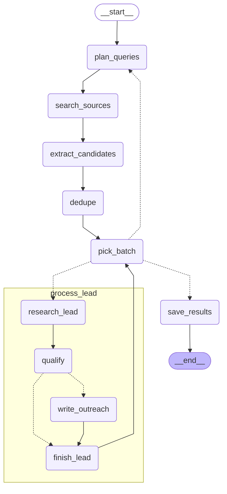

# Agent graph

```mermaid
---
config:
  flowchart:
    curve: linear
---
graph TD;
	__start__([<p>__start__</p>]):::first
	plan_queries(plan_queries)
	search_sources(search_sources)
	extract_candidates(extract_candidates)
	dedupe(dedupe)
	pick_batch(pick_batch)
	save_results(save_results)
	__end__([<p>__end__</p>]):::last
	__start__ --> plan_queries;
	dedupe --> pick_batch;
	extract_candidates --> dedupe;
	pick_batch -.-> plan_queries;
	pick_batch -.-> process_lead\3aresearch_lead;
	pick_batch -.-> save_results;
	plan_queries --> search_sources;
	process_lead\3afinish_lead --> pick_batch;
	search_sources --> extract_candidates;
	save_results --> __end__;
	subgraph process_lead
	process_lead\3aresearch_lead(research_lead)
	process_lead\3aqualify(qualify)
	process_lead\3awrite_outreach(write_outreach)
	process_lead\3afinish_lead(finish_lead)
	process_lead\3aqualify -.-> process_lead\3afinish_lead;
	process_lead\3aqualify -.-> process_lead\3awrite_outreach;
	process_lead\3aresearch_lead --> process_lead\3aqualify;
	process_lead\3awrite_outreach --> process_lead\3afinish_lead;
	end
	classDef default fill:#f2f0ff,line-height:1.2
	classDef first fill-opacity:0
	classDef last fill:#bfb6fc

```
